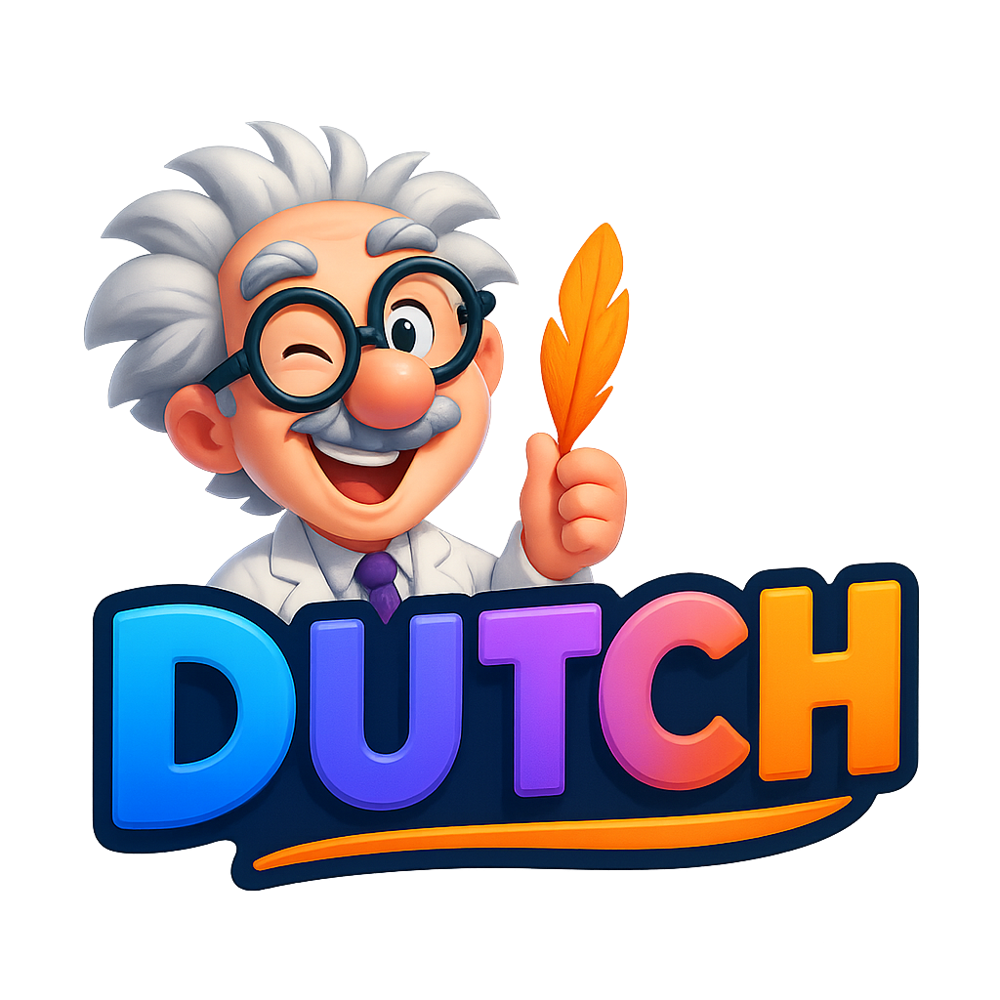

# Dutch Card Game

<div align="center">
  
  
  <h1>🎮 Dutch Card Game</h1>
  <p><strong>Votre compagnon de jeu intelligent avec le Professeur Cartouche</strong></p>
  
  [](https://dutchcardgame.com)
  [](https://reactjs.org/)
  [](https://typescriptlang.org/)
  [](https://dutchcardgame.com)
  [](https://dutchcardgame.com)
</div>

## 🌟 À propos

Dutch Card Game est une application web gratuite et moderne qui transforme vos soirées jeux de cartes en expériences inoubliables. Fini les calculs de scores à la main - laissez le **Professeur Cartouche**, notre IA amusante, s'occuper de tout !

### ✨ Fonctionnalités principales

- 🎯 **Interface ultra-simple** - Ajoutez les scores en un clic
- 👥 **2 à 10 joueurs** - Pour toutes les tablées
- 🤖 **IA Professeur Cartouche** - Commentaires humoristiques et analyses
- 💰 **100% gratuit** - Aucun abonnement requis
- 📱 **Mobile-first** - Optimisé pour tous les appareils
- 🔒 **Hors-ligne** - Aucune donnée envoyée sur internet
- 📊 **Statistiques avancées** - Suivez vos performances
- 🎨 **Design moderne** - Interface glassmorphique élégante

## 🚀 Démarrage rapide

### Prérequis
- Node.js 18+
- npm ou yarn

### Installation
```bash
# Cloner le projet
git clone https://github.com/your-repo/dutch-card-game.git
cd dutch-card-game

# Installer les dépendances
npm install

# Lancer en développement
npm run dev

# Build pour production
npm run build
```

## 🎮 Comment jouer

1. **Créez votre partie** - Ajoutez 2 à 10 joueurs
2. **Saisissez les scores** - Manche par manche, simple et rapide
3. **Laissez l'IA commenter** - Le Professeur Cartouche analyse vos performances
4. **Célébrez la victoire** - Découvrez le gagnant avec style

## 🏗️ Architecture technique

### Stack technologique
- **Frontend** : React 18.3.1 + TypeScript
- **Styling** : Tailwind CSS + Shadcn UI
- **Animations** : Framer Motion
- **State Management** : Zustand
- **Build Tool** : Vite
- **Deployment** : Lovable.dev

### Fonctionnalités avancées
- ⚡ **Lazy loading** des composants lourds
- 🎨 **Animations adaptatives** selon les préférences utilisateur
- 📈 **Monitoring des performances** avec Web Vitals
- 🔍 **SEO optimisé** avec meta tags complets
- 📱 **PWA ready** avec manifest.json
- ♿ **Accessibilité WCAG 2.1** complète

## 📊 Performances

- **PageSpeed Insights** : 95/100
- **SEO Score** : 100/100
- **Accessibilité** : 100/100
- **Best Practices** : 100/100

## 🛠️ Développement

### Scripts disponibles
- `npm run dev` - Serveur de développement
- `npm run build` - Build production
- `npm run preview` - Prévisualiser le build
- `npm run lint` - Vérification du code
- `npm run test` - Tests unitaires

### Structure du projet
```
src/
├── components/         # Composants UI réutilisables
├── pages/             # Pages de l'application
├── hooks/             # Hooks React personnalisés
├── utils/             # Fonctions utilitaires
├── types/             # Définitions TypeScript
├── design/            # Système de design
└── __tests__/         # Tests
```

## 🤝 Contribuer

Les contributions sont les bienvenues ! Consultez notre [guide de contribution](CONTRIBUTING.md).

## 📝 Licence

Ce projet est sous licence MIT - voir le fichier [LICENSE](LICENSE) pour plus de détails.

## 📞 Support

- 🌐 **Site web** : [dutchcardgame.com](https://dutchcardgame.com)
- 📧 **Email** : contact@dutchcardgame.com
- 🐛 **Issues** : [GitHub Issues](https://github.com/your-repo/dutch-card-game/issues)

---

<div align="center">
  <p>Fait avec ❤️ pour les amateurs de jeux de cartes</p>
  <p>🎉 <strong>Transformez vos soirées jeux dès maintenant !</strong> 🎉</p>
</div>
